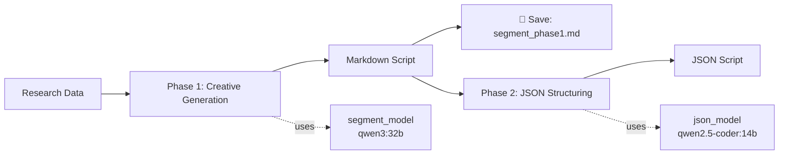

# Multi-Model Routing Guide

## 概要

2段階生成モード（Phase 1: クリエイティブ生成 → Phase 2: JSON構造化）において、各フェーズで異なるモデルを使用できるMulti-Model Routing機能を実装しました。

これにより、**Phase 1では創造性の高いモデル**、**Phase 2では構造化に特化したモデル**を使い分けることで、品質とVRAM効率を最適化できます。

> **本プロジェクトの現行構成（2026-04-30 GX10 移行後）**
>
> Mac Studio (32GB) → GX10 (128GB) への推論サーバー移行に伴い、現在は
> Phase 1/2 とも **`qwen3:32b`** に統一しています。VRAM 制約が緩和されたため、
> Multi-Model Routing による分担最適化よりも「指示遵守能力の高い大型モデル単一」
> の安定性を優先する構成です。FactExtractor のみ構造化 JSON タスクへの適性で
> **`qwen2.5-coder:32b`** を継続採用しています。`config.yaml` の実値が SSOT。
> 詳細は CHANGELOG.md「2026-04-30: GX10 推論サーバー移行に伴うモデル切替」を参照。
>
> 以下の VRAM 別推奨構成は、より制約のある環境向けの参考値として残しています。

---

## アーキテクチャ

### Phase 1: クリエイティブ生成
- **目的**: 自然で魅力的な会話台本を生成
- **推奨モデル**: 
  - `qwen3:32b` (高品質、VRAM 21GB+)
  - `gemma3:27b` (バランス型、VRAM 18GB+)
  - `gemma4:26b` (実験的、VRAM 18GB+)
- **特性**: 
  - 高いtemperature (0.85)
  - 長い出力 (max_tokens: 4096)
  - Markdown形式

### Phase 2: JSON構造化
- **目的**: Phase 1のMarkdownを正確にJSON化
- **推奨モデル**: 
  - `qwen2.5-coder:14b` (構造化特化、VRAM 10GB)
  - `qwen2.5-coder:7b` (軽量、VRAM 6GB)
- **特性**: 
  - 低いtemperature (0.1)
  - 短い出力 (max_tokens: 2048)
  - JSON形式

---

## 設定方法

### config.yaml

```yaml
script_generator:
  orchestrator:
    enabled: true
    two_phase_generation: true
    
    # Phase 1（クリエイティブ生成）用モデル
    segment_model: "qwen3:32b"  # または gemma3:27b
    
    # Phase 2（JSON構造化）専用モデル
    json_model: "qwen2.5-coder:14b"  # 構造化特化モデル
```

**注意**: 
- `json_model`が空の場合、`segment_model`と同じモデルが使用されます
- 両方空の場合、UIで選択したプロバイダーのデフォルトモデルが使用されます

---

## 推奨構成（VRAM別）

### 🟢 High-End (VRAM 24GB+)
```yaml
segment_model: "qwen3:32b"           # Phase 1: 最高品質
json_model: "qwen2.5-coder:14b"      # Phase 2: 構造化特化
```
- **期待品質**: 最高
- **VRAM使用量**: Phase 1で21GB、Phase 2で10GB（逐次実行のため問題なし）

---

### 🟡 Mid-Range (VRAM 18-24GB)
```yaml
segment_model: "gemma3:27b"          # Phase 1: バランス型
json_model: "qwen2.5-coder:14b"      # Phase 2: 構造化特化
```
- **期待品質**: 高
- **VRAM使用量**: Phase 1で18GB、Phase 2で10GB

---

### 🟠 Budget (VRAM 12-18GB)
```yaml
segment_model: "gemma4:26b"          # Phase 1: 実験的
json_model: "qwen2.5-coder:7b"       # Phase 2: 軽量版
```
- **期待品質**: 中〜高
- **VRAM使用量**: Phase 1で18GB、Phase 2で6GB

---

### 🔴 Low-End (VRAM 8-12GB)
```yaml
segment_model: "qwen2.5:14b"         # Phase 1: 汎用モデル
json_model: "qwen2.5-coder:7b"       # Phase 2: 軽量版
```
- **期待品質**: 中
- **VRAM使用量**: Phase 1で10GB、Phase 2で6GB

---

## 動作フロー



1. **Phase 1**: `segment_model`でMarkdown台本を生成
2. **保存**: `{segment_id}_phase1.md`として保存
3. **Phase 2**: `json_model`でJSON形式に変換
4. **出力**: 最終的なJSON台本

---

## ログ出力例

### 単一モデル使用時
```
SegmentGenerator initialized: two_phase_enabled=True, model=qwen3:32b
  Phase 1 API: provider=ollama, model=qwen3:32b, max_tokens=4096, temperature=0.85
  Phase 2 API: provider=ollama, model=qwen3:32b, max_tokens=2048, temperature=0.1
```

### Multi-Model Routing使用時
```
SegmentGenerator initialized: two_phase_enabled=True, phase1_model=qwen3:32b, phase2_model=qwen2.5-coder:14b
  Phase 1 API: provider=ollama, model=qwen3:32b, max_tokens=4096, temperature=0.85
💾 Markdown saved: intro_phase1.md
  Phase 2 API: provider=ollama, model=qwen2.5-coder:14b, max_tokens=2048, temperature=0.1
✓ 正規表現パーサーでJSON生成完了
```

---

## メリット

### 1. 品質向上
- Phase 1で創造性の高いモデルを使用 → 自然な会話
- Phase 2で構造化特化モデルを使用 → 正確なJSON

### 2. VRAM効率化
- Phase 2で軽量モデルを使用 → メモリ節約
- 逐次実行のため、合計VRAMは最大フェーズのみ

### 3. コスト削減
- Phase 2の軽量化により、トークン消費量削減
- 高品質モデルはPhase 1のみに限定

---

## トラブルシューティング

### Q: Phase 2でJSON生成が失敗する
**A**: `json_model`に構造化特化モデル（`qwen2.5-coder`系）を指定してください。

### Q: VRAM不足エラーが発生する
**A**: Phase 1とPhase 2は逐次実行されるため、両方のモデルが同時にロードされることはありません。Phase 1のモデルサイズを確認してください。

### Q: Ollamaで「model not found」エラー
**A**: 事前にモデルをダウンロードしてください:
```bash
ollama pull qwen3:32b
ollama pull qwen2.5-coder:14b
```

---

## 関連ファイル

- `config.yaml`: モデル設定
- `services/script_generation/segment_generator.py`: Multi-Model Routing実装
- `services/script_generation/orchestrator.py`: オーケストレーター
- `output/{session_id}/*_phase1.md`: Phase 1のMarkdown台本（デバッグ用）

---

## 更新履歴

- **2026-04-10**: Multi-Model Routing機能実装（Phase 1とPhase 2で異なるモデルを使用可能に）
